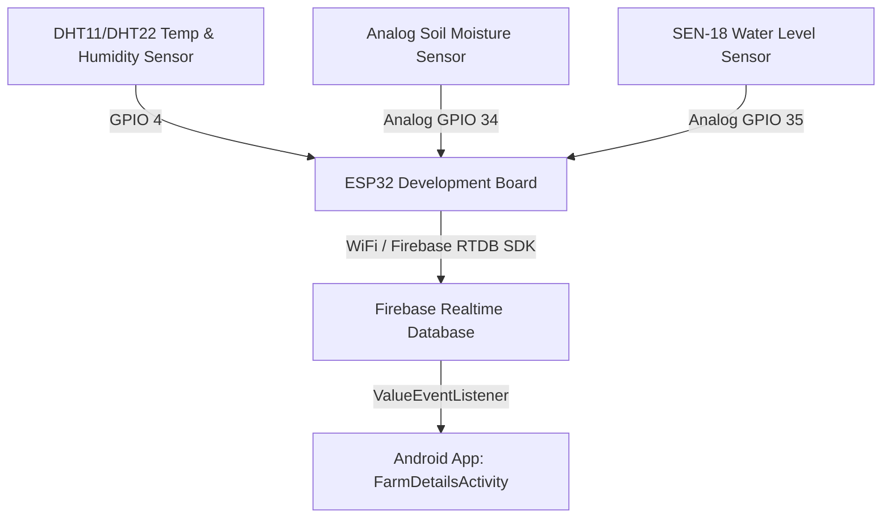

# AgriSense AI Irrigation Hardware Integration Guide

This guide details how to connect the physical hardware sensors to the **ESP32**, set up the **Firebase Realtime Database**, and sync data to the **AgriSense Android Application**.

---

## 1. Hardware Connections (Wiring Pinout)

Connect your sensors to the ESP32 development board according to the following schematic table:

| Sensor | Sensor Pin | ESP32 GPIO Pin | Description |
| :--- | :--- | :--- | :--- |
| **DHT11 / DHT22** | VCC | 3.3V / 5V | Power Input |
| | GND | GND | Ground |
| | DATA | **GPIO 4** | Digital Data Pin |
| **Soil Moisture Sensor** | VCC | 3.3V | Power Input |
| | GND | GND | Ground |
| | A0 (Analog Out) | **GPIO 34 (Analog VP)** | Reads analog moisture level (0 - 4095) |
| **SEN-18 Water Level Sensor** | VCC | 3.3V | Power Input |
| | GND | GND | Ground |
| | OUT (Analog Out) | **GPIO 35 (Analog)** | Reads analog water level height |

---

## 2. Arduino IDE Setup & Configuration

To upload the ESP32 code:

1. Open **Arduino IDE**.
2. Go to **File > Preferences** and add the ESP32 URL to **Additional Boards Manager URLs**:
   `https://raw.githubusercontent.com/espressif/arduino-esp32/gh-pages/package_esp32_index.json`
3. Go to **Tools > Board > Boards Manager**, search for `esp32`, and install the latest version by **Espressif Systems**.
4. Go to **Sketch > Include Library > Manage Libraries**, search for and install:
   - **`Firebase ESP Client`** (by Mobizt)
   - **`DHT sensor library`** (by Adafruit)
   - **`Adafruit Unified Sensor`** (by Adafruit)
5. Open [ESP32_AgriSense.ino](file:///c:/Users/anves/StudioProjects/AgriSense/ESP32_AgriSense.ino).
6. Edit the credentials inside the code:
   - `#define WIFI_SSID "YOUR_WIFI_SSID"`
   - `#define WIFI_PASSWORD "YOUR_WIFI_PASSWORD"`
   - `#define API_KEY "YOUR_FIREBASE_API_KEY"`
   - `#define DATABASE_URL "YOUR_FIREBASE_DATABASE_URL"`
7. Connect your ESP32 via micro-USB, select the corresponding port under **Tools > Port**, select your board model (e.g. **ESP32 Dev Module**), and click **Upload**.

---

## 3. Firebase Console Setup

To obtain your Firebase Credentials:

1. Go to the [Firebase Console](https://console.firebase.google.com/).
2. Click **Project Settings** (cog icon in left panel).
3. Under **General > Web API Key**, copy this token. This is your `#define API_KEY`.
4. Go to **Realtime Database** (build menu on left).
5. Copy the database endpoint URL (e.g., `https://your-project-id-default-rtdb.firebaseio.com/`). This is your `#define DATABASE_URL`.
6. Go to **Rules** tab, and configure read/write permissions. For early-phase testing, write anonymous rules (ensure to configure proper security before deployment):
   ```json
   {
     "rules": {
       ".read": true,
       ".write": true
     }
   }
   ```
7. Go to **Build > Authentication > Sign-in method**, enable **Anonymous** sign-in, and click save. (This allows the ESP32 to authenticate anonymously using the web API Key).

---

## 4. Realtime Database Structure

When running, the ESP32 writes to the `sensorData` node. The combined database structure will be:

```json
{
  "sensorData": {
    "temperature": 33.5,
    "humidity": 58.2,
    "soilMoisture": 420,
    "farmWaterLevel": 72,
    "timestamp": 1750868400
  },
  "farms": {
    "farm001": {
      "farmId": "-Nx123...",
      "farmName": "South Block",
      "location": "Plot 3",
      "cropType": "Wheat",
      "totalAcres": "3",
      "moistureThreshold": 500,
      "irrigationSchedule": "Morning",
      "notes": "Organic farming test",
      "createdAt": 1782000000,
      "healthStatus": "Water Required",
      "soilMoisture": 420,
      "nextWatering": "Today 04:35 PM"
    }
  }
}
```

---

## 5. Realtime Data Flow Diagram


